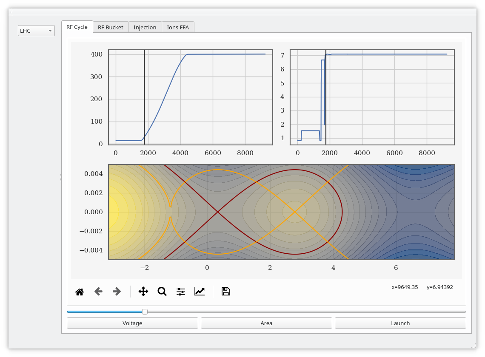

# PyQt5AppAll
Collection of CCC tabs for SPS LLRF control

### View the cycle evolution

### Create voltage programs
<!---->

### Manage injections

### Control ions and FFA

### Control slip stacking